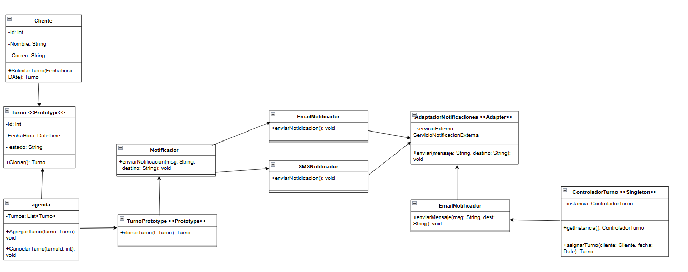

# turnos-medicos
Sistema de gestión de turnos médicos

## Descripción General
Este sistema de gestion de turnos digitales diseñado para optimizar la atención en entornos físicos. Este proyecto refleja la transición completa desde una visión funcional hasta una arquitectura física profesional, usando UML y patrones de diseño.

**Justificación de relaciones**:
- `<<include>>`: Para modelar pasos obligatorios como *Autenticación* antes de gestionar turnos.
- `<<extend>>`: Para mostrar funciones opcionales como la evaluación del servicio.

·Diagrama de Clases UML

*Resumen técnico*:
El diseño implementa principios de responsabilidad única, bajo acoplamiento y alta cohesión. Se aplicaron los siguientes patrones de diseño:

- `<<Singleton>>`: Para la clase `GestorTurnos`, garantizando una única instancia de control de turnos.
- `<<Prototype>>`: Para la clase `Turno`, facilitando la clonación de turnos similares.
- `<<Adapter>>`: Para integrar una API externa de notificaciones sin modificar el núcleo.
- (Opcional) `<<Bridge>>`: Si decidiste aplicarlo, justificar aquí.

*Justificación de patrones*:
- **Singleton* evita múltiples instancias del gestor.
- **Prototype* mejora la reutilización de configuraciones comunes de turno.
- **Adapter* facilita la interoperabilidad con otros sistemas (por ejemplo, SMS o correo).

# Diagrama de Implementación UML
.png)
*Resumen de arquitectura física*:
- El sistema está distribuido en tres nodos:
  - *Cliente web* (navegador)
  - *Servidor de aplicación* (Node.js/Express, por ejemplo)
  - *Base de datos* (MySQL/PostgreSQL)
- Se muestra conexión segura, componentes desacoplados y uso de APIs REST.

**Notas UML**:
- `GestorTurnos` como Singleton se implementa en el servidor de aplicación.
- Adaptador de notificaciones se despliega como microservicio.
- Clases persistentes conectadas al nodo de base de datos con DAO.

- # 💬 Reflexión Final

Este proyecto permite demostrar el dominio integral del modelado arquitectónico con UML, aplicando patrones de diseño y buenas prácticas. La estructura lógica y física del sistema refleja un diseño profesional y mantenible, preparado para escalar funcional y técnicamente.

---

## 👤 Autor

- Nombre: [Juan peña]
- Carrera: [Ingenieria en informatica]
- Fecha: 22 Mayo 2025
